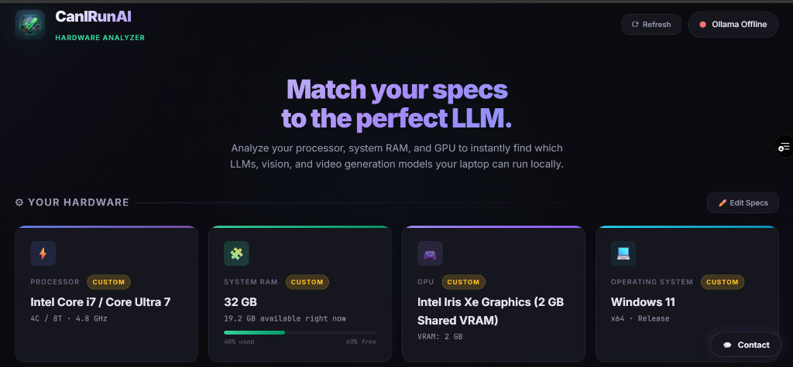

# CanIRunAI

> Ever wondered if you can run LLaMA 3 or Mixtral locally? CanIRunAI checks your VRAM, RAM, and compute power to tell you exactly what fits.

<p align="center">
  <a href="https://canirunai-five.vercel.app" target="_blank">
    
  </a>
  <a href="https://github.com/Ugochi56/CanIRunAI/stargazers">
    
  </a>
  <a href="#-license">
    
  </a>
</p>

<p align="center">
  
</p>

<p align="center">
  <em>Match your specs to the perfect LLM.</em>
</p>

---

**CanIRunAI** is a local-first web application that analyzes your hardware and instantly tells you which AI models — LLMs, vision models, image generators, and video generators — your system can actually run. 

Think of it as **"Can You Run It?" for the modern AI ecosystem.**

---

## ✨ Features

- **🌐 100% In-Browser Auto-Detection** — Scans your GPU, VRAM, and RAM in 0ms using WebGL without requiring any local installs or extensions.
- **⚙️ Custom Rig Simulator** — Manually test hypothetical setups (simulate RTX 5090 / 4090, Apple M4 Max, 64GB RAM, Intel Iris Xe, etc.).
- **⚖️ Dynamic Quantization Precision** — Toggle between **Q4, Q5, Q8, and FP16** to see how memory requirements and compatibility ratings shift in real time.
- **🧠 60+ Model Database** — DeepSeek (R1 / V3), LLaMA 3.1/3.2, Qwen 2.5, Gemma 2, Mistral, FLUX.1, SDXL, Wan 2.1, HunyuanVideo, and more.
- **🍎 Apple Silicon & Unified Memory** — Accurately calculates unified memory allocation and Metal limits for M1/M2/M3/M4 Macs.
- **⚡ GPU VRAM vs. RAM Offload Breakdown** — Distinguishes between 100% GPU VRAM execution (fastest) and CPU/RAM layer offloading (slower).
- **🖥️ CPU-Only Models** — Highlights models that run smoothly without any dedicated GPU (stable-diffusion.cpp, LCM, OpenVINO).
- **📸 Shareable Compatibility Card** — Generates a downloadable 1200×630 summary graphic of your system's capabilities for Discord, Reddit, or X.
- **⬇️ One-Click Ollama Pulling** — When run locally, stream-pull models directly into your local Ollama runtime.

---

## 📸 How It Works

1. **Visit the Web App** — Head to [canirunai-five.vercel.app](https://canirunai-five.vercel.app) (or run locally).
2. **Auto-Detect or Edit Specs** — View your detected hardware, or click **✏️ Edit Specs** to test any custom rig.
3. **Select Precision** — Toggle between `Q4 (Standard)`, `Q5`, `Q8`, or `FP16` to view exact RAM/VRAM loads.
4. **Browse Compatibility** — Filter by category (Chat, Code, Vision, Video, Image, CPU-Only) or search by name.

---

## 🚀 Quick Start (Local Development)

You can run CanIRunAI locally to enable direct Ollama pulling and exact OS-level hardware detection:

### Prerequisites

- [Node.js](https://nodejs.org/) v18+
- [Ollama](https://ollama.com/download) *(optional — only needed to pull/run models locally)*

### Install & Run

```bash
git clone https://github.com/Ugochi56/CanIRunAI.git
cd CanIRunAI
npm install
npm run dev
```

Open **http://localhost:3456** in your browser.

> No complex bundlers, build steps, or database setup required.

---

## 🗂 Project Structure

```
CanIRunAI/
├── server.js          # Express server — hardware detection, Ollama proxy, SSE streaming
├── public/
│   ├── index.html     # Single-page application — UI, model database, compatibility engine
│   ├── logo.png       # App logo
│   └── og-preview.png # Social & README preview screenshot
├── package.json
└── vercel.json        # Static deployment config for Vercel
```

---

## 🧠 Model Categories

| Category | Examples | What's Checked |
|:---|:---|:---|
| 💬 **Chat & Reasoning** | DeepSeek R1, Llama 3.1, Qwen 2.5, Mistral, Gemma 2 | GPU VRAM + System RAM (Quantized) |
| 💻 **Code** | Qwen 2.5 Coder, DeepSeek Coder V2, StarCoder2, CodeLlama | System RAM & VRAM |
| 👁 **Vision** | LLaVA 13B, Llama 3.2 Vision | System RAM & VRAM |
| 🔤 **Embedding** | Nomic, MxBai, all-MiniLM | System RAM |
| 🎨 **Image Gen** | FLUX.1 (Dev/Schnell), SDXL, SD 1.5, PixArt | Dedicated GPU VRAM |
| 🎬 **Video Gen** | Wan 2.1, HunyuanVideo, CogVideoX, Mochi | High VRAM Thresholds |
| 🖥 **CPU-Only** | stable-diffusion.cpp, LCM, OpenVINO | CPU RAM only (No GPU needed) |

---

## 🔧 Tech Stack

- **Frontend:** Vanilla HTML5, CSS3, Modern ES6+ JavaScript, WebGL (Hardware detection), HTML5 Canvas
- **Backend (Local Mode):** Node.js + Express
- **Hardware Telemetry:** [systeminformation](https://github.com/sebhildebrandt/systeminformation)
- **Deployment:** Vercel Static Hosting

---

## 🤝 Contributing

Contributions are warmly welcomed! Some easy ways to contribute:

- **Add new models** — Add missing LLMs or diffusion models to `MODEL_DB` in `public/index.html`
- **Refine compatibility rules** — Help tweak RAM/VRAM offload thresholds
- **Suggest features** — Use the in-app **💡 Request Feature** button or open a GitHub Issue

---

## 📄 License

MIT © [CanIRunAI Contributors](LICENSE)

---

<p align="center">
  Built for the local AI community 🤖
</p>
